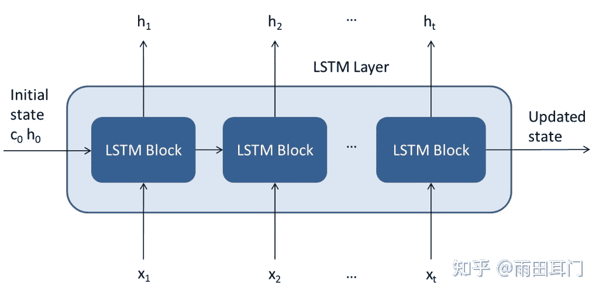
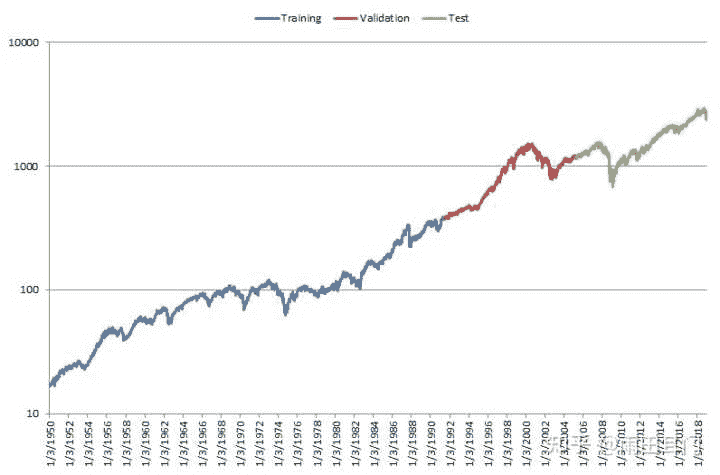
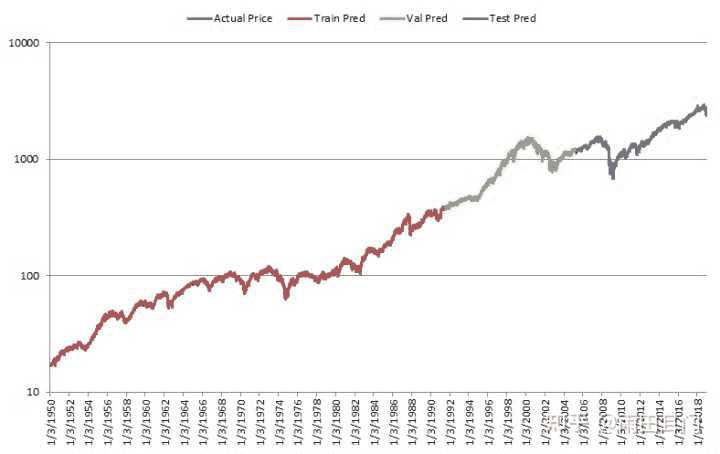
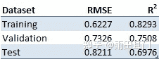
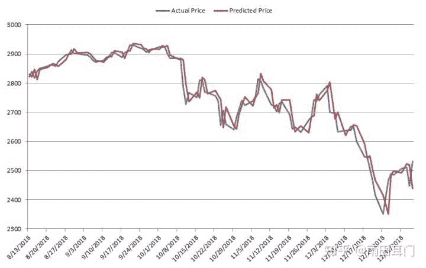
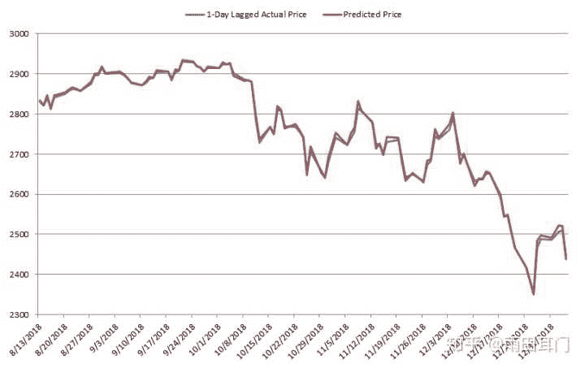

<!--yml
category: Quant
date: 2022-07-01 19:05:11
-->

# 机器学习在金融中的应用：不应该使用LSTM预测股市的原因

> 来源：[https://www.zhihu.com/question/524724513/answer/2539139917](https://www.zhihu.com/question/524724513/answer/2539139917)

## **概要**

最近，机器学习领域产生了很多的发展和兴趣，同时在语音和图像识别有了很好的研究成果。这篇研究文章分析了一种深度学习方法的表现:长短期记忆神经网络（LSTM），其应用于以S&P500为代表的美国股市。这篇文章证明了尽管这种技术也许曾经在其他领域例如语音识别领域取得了成功，但是当它应用于金融数据时并不能有一个很好的表现。事实上，金融数据的噪声与信号比较高的特点使得机器学习模型很难去找到规律并对未来价格进行预测。

这篇研究文章的结构如下：第一个部分介绍了LSTM以及为什么它们能应用于金融时间序列。第二个部分分析了LSTM应用在S&P500的表现。第三个部分进行总结。

## **1\. 什么是LSTM?**

长短期记忆神经网络是一种特殊的深度学习模型。确切来说，它是一种可以学习数据间长期依赖关系的周期性神经网络，所以它通常被用于时间序列的预测。

图一显示了一个LSTM层的架构。

图1：LSTM层架构

如图所示，它由重复的核心模块组成。这种结构使得LSTM能够用来学习长期的依赖关系。第一个LSTM块接收网络的初始阶段和序列X1的第一个时间步骤，然后计算第一个结果h1和更新后的单元c1 。在时间阶段t的时候，该模块获取该网络（ct-1 , ht-1）的当前状态以及序列Xt 的下一个时间阶段，然后计算ht的结果和更新后的单元ct。

图2：LSTM块架构

图2显示了其中一个LSTM模块的架构，它由4个主要部分组成：

*   输入端：它控制单元状态的更新等级。
*   遗忘端：它控制单元状态的重置等级。
*   单元候选：添加信息到单元状态。
*   输出端：他控制添加到隐藏端的单元状态等级。

为了学习建模任务的特点并进行预测，LSTM需要被训练。这个过程由计算LSTM的权重和偏差组成，通过优化算法中最小化目标函数，尤其是RMSE。一旦模型在最初的训练数据集上进行了训练，并在验证集上进行了验证，它就会在真实样本外测试中被测试。这确保了模型确实学到了有用的特征，并且它在训练集上没有过度拟合从而导致对新数据的预测能力很差。下一部分将分析应用于S&P500的LSTM表现。

## **2\. 应用于美国股票市场的LSTM表现。**

使用的数据集由美国股市的每日收盘价组成，其以S&P500为代表，从1950年1月3日到2019年1月4日，总共有17364个观测值。该数据的60%用于训练，20%用于验证，20%用于测试。

图3显示了用于分析的数据的对数分度。

图3：S&P 500 收盘价格（对数分度）

在我们的分析中，我们训练了一个由1个隐藏层、20个神经元和时间序列长度为20个值组成的LSTM神经网络。我们尝试了神经网络参数和结构的不同组合然后发现其结果相似。

图4显示了实际价格与经过训练的LSTM预测的第二天的数值的对比。

图4 LSTM对S&P500的预测VS实际价格（对数分度）。

从图中可以看出，预测值与实际价格非常接近，因此无法正确看到潜在的实际价格。所以看起来LSTM在预测所考虑的时间序列的下一个值做得很好。

表1报告了LSTM预测第二天价格准确性的表现统计。

表1：LSTM预测准确性统计

这个数据佐证了我们从图4中可以看到的情况。低RMSE和良好的R2值表明LSTM可能善于预测所考虑的时间序列的下一个值。

图5显示了从2018年8月13日到2019年1月4日的100个实际价格与预测价格的对比样本。

图5： LSTM预测VS S&P 500 100天的价格

这个图标让我们得出了一个不同的结论。虽然从总体上看，LSTM似乎在预测第二天价格这方面是有效的，但实际上，第二天的预测与前一天的实际价格非常接近。从图6中可以进一步看出这点，图6显示了一天前的实际价格与该天预测价格的对比。

图6：100天的LSTM预测VS一天前S&P 500 价格

如图所示，这两个系列几乎是相同的，这证实了我们之前的结论。

这些结果表明LSTM无法预测股市第二天的价格。事实上，该模型所能做出的最佳预测是几乎与当日价格相同的值。

## 3\. 结论

虽然新的机器学习算法，特别是深度学习，确实在不同的领域取得了相当大的成功，但它们并不能预测美国的股票市场。正如前面的分析所证明的，LSTM仅仅用一个非常接近前一天收盘价的数值作为第二天的预测值。这意味着它是一个没有预测能力的模型。

这也突出表明了尽管一些机器学习技术在金融领域可能是有用的，但量化对冲基金必须采取另一种途径，并且提出一种能够为客户提供阿尔法的策略。

* * *

原文章来自BlueSky网站，本文为原文章的中文翻译。本文仅用于交流学习使用，不得用于商业用途。如对相关著作人造成侵害，请立即联系译者及时删除。

原文链接：[Machine Learning in Finance: Why You Should Not Use LSTM’s to Predict the Stock Market](https://link.zhihu.com/?target=https%3A//www.blueskycapitalmanagement.com/machine-learning-in-finance-why-you-should-not-use-lstms-to-predict-the-stock-market/)